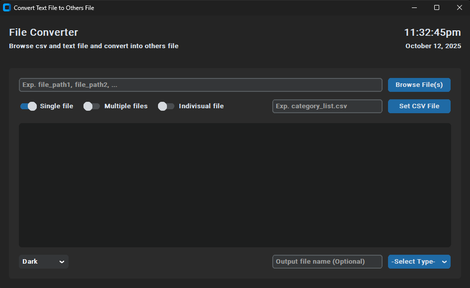
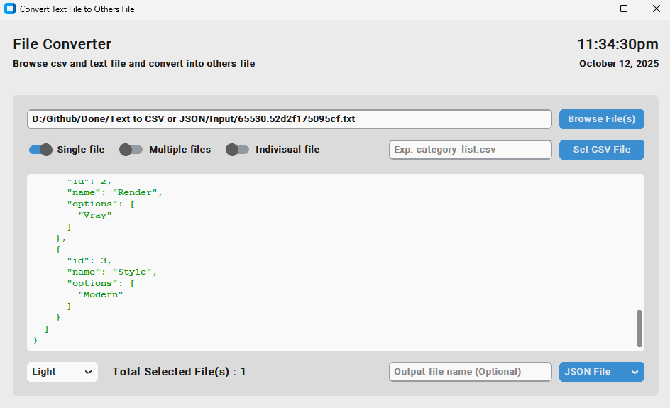

# 🔄 CTk Text To CSV/JSON Converter

A modern **CustomTkinter** application to convert plain text into **CSV** or **JSON** format. This tool is perfect for data preprocessing, exporting structured data and automating text-to-data workflows with an intuitive GUI.


## ✨ Features

- 📝 Convert plain text input to **[CSV](https://en.wikipedia.org/wiki/Comma-separated_values)** or **[JSON](https://www.w3schools.com/whatis/whatis_json.asp)**  
- 🎨 Modern **CustomTkinter UI** with Light/Dark mode  
- ⚡ Fast and responsive interface  
- 💾 Save files directly from the app  
- 🔧 Easy to customize input parsing and export format  
- 🖥 Cross-platform: **Windows, Linux, macOS**  
- 💡 Beginner-friendly, minimal dependencies  


## 📌 Technologies Used

### **Tkinter**
Tkinter is Python’s standard GUI library used for building cross-platform desktop applications.

### **CustomTkinter**
[CustomTkinter](https://github.com/TomSchimansky/CustomTkinter) extends Tkinter with:

- Modern, consistent design  
- Light & Dark themes  
- High-DPI scaling  
- Fully customizable modern widgets  

Together, they ensure a smooth UI experience on **Windows**, **macOS** and **Linux**.

| Component | Description |
|------------|--------------|
| **Language** | Python 3.x |
| **GUI Framework** | CustomTkinter |
| **Core Libraries** | Tkinter, CustomTkinter |


## 🧰 Installation Steps

### Step 1. Clone the repository

```bash
git clone https://github.com/iamx-ariful-islam/CTk-Text-To-CSV-JSON.git
cd CTk-Text-To-CSV-JSON
```

### Step 2. Install Python Dependencies

The `requirements.txt` file, lists of all the Python libraries that "**_ctk text to csv json_**" depends on and installs those packages from the file:

```bash
pip install -r requirements.txt
# or (Linux/MacOS)
sudo pip install -r requirements.txt
```

### Step 3. Run the Application
```bash
python main.py
```


## 📂 Folder Structure
Here’s the structure of the **CTk Text To CSV JSON** project:

```bash
CTk-Text-To-CSV-JSON/
│
├── screenshots/
├── main.py
│── LICENSE
├── notes.txt
├── README.md
└── requirments.txt
```


## 🖼️ Screenshots

Here are some screenshots of the `CTk Text To CSV JSON` project:

**Main Window - Dark Mode**<br/>
<br/>
**Output Main Window - Light Mode**<br/>



## 📄 Notes File (How it works)
View full notes here: 👉 [notes.txt](notes.txt)

1. Show file(s) full path with comma separated
1. Open text file dialog box by clicking "Browse File(s)"
1. Open csv file dialog box by clicking "Set CSV File"
1. Browse single file at a time
1. Browse multiple files at a time
1. Generate indivisual output file or not
1. Enter output file name (Optional)
1. Show the output result data
1. Change/Select the theme mode (Default: Dark)
1. Select the output file type for generate file(s) [TEXT File, JSON File, CSV File]


## 🤝 Contributing

Contributions, suggestions, and feedback are always welcome! ❤️<br/>
To contribute:

1. Fork the repository
2. Create a new branch (`feature/new-feature`)
3. Commit your changes
4. Push and submit a Pull Request

💬 You can also open an issue if you’d like to discuss a feature or report a bug.


## 🌐 For more or connect with me

<p align='center'>
  <a href="https://github.com/iamx-ariful-islam"></a>&nbsp;&nbsp;
  <a href="https://bd.linkedin.com/in/iamx-ariful-islam"></a>&nbsp;&nbsp;
  <a href="https://x.com/mx_ariful_islam"></a>&nbsp;&nbsp;
  <a href="https://www.facebook.com/iamx.ariful.islam/"></a>
</p>


## 📜 License

The [MIT](https://choosealicense.com/licenses/mit/) License (MIT)


## 💖 Thank You for Visiting!

> “Good design is about making things simple yet significant”  
> — *Md. Ariful Islam*